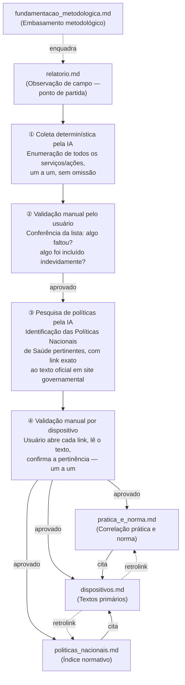
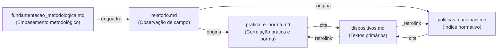

# Mapeamento Normativo da UBS Lázaro Moreno

**Uberaba-MG · Girassóis IV · Verificação: junho de 2026**

Este projeto mapeia, de forma determinística, os dispositivos das políticas nacionais de saúde que amparam cada ação observada na Unidade Básica de Saúde Lázaro Moreno. O ponto de partida é um relatório de visita de campo. O ponto de chegada é o texto primário, verificado na fonte oficial, de cada norma aplicável.

---

## Índice

- [Por que este projeto existe](#readme-why)
- [Posição em relação à literatura existente](#readme-posicao)
- [Arquitetura dos documentos](#readme-arch)
- [Princípio DRY aplicado à norma](#readme-dry)
- [Metodologia](#readme-metodologia)
- [Convenções de status dos instrumentos](#readme-status)
- [Instrumentos mapeados](#readme-instrumentos)
- [Como replicar para outra UBS](#readme-replicar)
- [Como atualizar quando uma portaria mudar](#readme-atualizar)
- [Unidade documentada](#readme-unidade)

---

## Por que este projeto existe

Políticas nacionais de saúde existem em papel. A questão determinante é: **qual dispositivo específico, de qual portaria vigente, fundamenta o que uma equipe de saúde faz todos os dias?**

Este repositório responde a essa pergunta para a UBS Lázaro Moreno. Mas a estrutura é replicável para qualquer UBS.

---

## Posição em relação à literatura existente

A avaliação de implantação de políticas de Atenção Primária à Saúde no Brasil é um campo consolidado. O PMAQ (Programa de Melhoria do Acesso e da Qualidade), encerrado em 2019, gerou ciclos nacionais de avaliação de UBS com produção acadêmica extensa. O PCATool — instrumento validado para medir os atributos da APS segundo Starfield — é amplamente utilizado em pesquisas que comparam o que as políticas preveem com o que as equipes e usuários experimentam. Universidades e institutos de pesquisa, especialmente Fiocruz, UFMG e USP, têm grupos estabelecidos nesse campo.

A pergunta central deste projeto — como as políticas nacionais se materializam no cotidiano de uma UBS — não é nova.

O que este projeto não replica é o nível de granularidade normativa: não "a UBS cumpre a PNAB?" mas "qual artigo, qual inciso, qual item do Anexo ampara cada ação específica observada — e esse dispositivo está vigente?". Os instrumentos avaliativos consolidados medem atributos e experiências; este projeto mapeia a ancoragem normativa precisa de práticas observadas, com rastreabilidade até a fonte primária e verificação ativa de vigência.

A utilidade disso não é substituir avaliações robustas de APS. É oferecer algo diferente: um instrumento de mediação entre a norma e quem trabalha na ponta — estudantes aprendendo a ler políticas públicas, gestores municipais que precisam documentar práticas, equipes que desconhecem o respaldo legal do que fazem. E, com o processo aqui descrito, algo que qualquer pessoa com um relatório de campo consegue replicar sem ser especialista em direito sanitário.

A eventual contribuição acadêmica está menos na originalidade da pergunta e mais na acessibilidade e reprodutibilidade do processo — especialmente com o uso de IA como ferramenta de sistematização auditável.

---

## Arquitetura dos documentos

### Fluxo de construção

O diagrama abaixo mostra **como o projeto é construído**, incluindo as etapas intermediárias de coleta e validação que precedem a geração dos documentos finais.

### Estrutura final dos documentos

Todos os links são bidirecionais: cada documento referencia os outros via âncoras explícitas `<a id="...">` que funcionam em qualquer renderizador Markdown compatível com CommonMark.

| Arquivo | Papel | Lê antes de... |
|---|---|---|
| [`relatorio.md`](relatorio.md) | Observação de campo — o que a UBS faz | Qualquer outro |
| [`pratica_e_norma.md`](pratica_e_norma.md) | Correlação entre cada ação observada e o dispositivo que a ampara | [`dispositivos.md`](dispositivos.md) |
| [`politicas_nacionais.md`](politicas_nacionais.md) | Índice organizado por política: dispositivos, transcrições resumidas e relação com o relatório | [`dispositivos.md`](dispositivos.md) |
| [`dispositivos.md`](dispositivos.md) | Textos primários completos, links às fontes oficiais e retrolinks aos documentos analíticos | — |
| [`fundamentacao_metodologica.md`](fundamentacao_metodologica.md) | Tradições acadêmicas e autores de referência que embasam o desenho do projeto | [`relatorio.md`](relatorio.md) |

---

## Princípio DRY aplicado à norma

O texto de cada dispositivo legal vive em **um único lugar**: [`dispositivos.md`](dispositivos.md).

Os documentos analíticos (`pratica_e_norma.md` e `politicas_nacionais.md`) apenas **referenciam** esses textos via links. Se uma portaria for revogada ou atualizada:

1. Edite **apenas** [`dispositivos.md`](dispositivos.md)
2. Atualize o status do instrumento (`[vigente]` → `[revogado]` ou `[atualizado]`)
3. Registre o instrumento substituto com o novo anchor
4. Os links dos demais documentos **não precisam ser alterados** — a ancoragem por ID é estável

---

## Metodologia

**Ponto de partida**: relatório de visita de campo à UBS Lázaro Moreno ([`relatorio.md`](relatorio.md)). O relatório tem abordagem **descritiva**: narra o que foi observado, sem já estabelecer vínculos normativos.

A partir do relatório, o processo se divide em duas fases com validação manual antes de qualquer documento analítico ser gerado.

---

### Fase 1 — Coleta determinística e validação da lista de serviços

**Etapa 1 — Enumeração pela IA**: a IA lê o relatório e lista **todos** os serviços, ações e situações observados, um a um, sem omissão. O critério é exaustividade: nenhum aspecto do relatório pode ser silenciado nessa listagem.

**Etapa 2 — Validação manual pelo usuário**: o usuário confere a lista item a item. Verifica se algum serviço ficou faltando; verifica se algo foi incluído indevidamente (ex.: inferência não amparada pelo relato). Somente após aprovação da lista o processo avança.

---

### Fase 2 — Pesquisa normativa e validação por dispositivo

**Etapa 3 — Pesquisa de Políticas Nacionais de Saúde pela IA**: para cada serviço ou ação da lista validada, a IA identifica quais **Políticas Nacionais de Saúde** são pertinentes — exclusivamente políticas nacionais instituídas pelo Ministério da Saúde, não leis ou normas que não sejam relacionadas ou derivadas de políticas de saúde. Para cada política identificada, a IA fornece:
- o dispositivo específico (artigo, inciso, alínea, item de Anexo);
- o **link exato ao texto da norma em site oficial** (bvsms.saude.gov.br ou gov.br/saude);
- nos casos em que o link oficial direto não for acessível pela IA, a referência completa para que o usuário localize o texto por busca ou cópia-e-cola.

**Etapa 4 — Validação manual por dispositivo**: o usuário analisa **cada dispositivo individualmente**, abrindo o link gerado ou buscando a referência fornecida. Confirma: o texto existe naquele endereço? O dispositivo é pertinente à ação observada? O instrumento está vigente? Somente após aprovação dispositivo a dispositivo o processo avança para a geração dos documentos.

---

### Fase 3 — Geração dos documentos

Com a lista de serviços e a ancoragem normativa aprovadas pelo usuário, os documentos analíticos são gerados:

- [`pratica_e_norma.md`](pratica_e_norma.md): cada ação correlacionada ao dispositivo que a ampara.
- [`politicas_nacionais.md`](politicas_nacionais.md): índice organizado por política, com dispositivos e relação com o relatório.
- [`dispositivos.md`](dispositivos.md): textos primários completos, links às fontes oficiais e retrolinks aos documentos analíticos.

---

**O que "determinístico" significa aqui**: cada dispositivo citado pode ser localizado na fonte que consta em [`dispositivos.md`](dispositivos.md), na URL indicada, e o texto transcrito pode ser verificado por qualquer pessoa. Não há inferência sobre o conteúdo da norma — apenas transcrição do verificado.

**Escopo**: somente instrumentos com correspondência direta a ações descritas no relatório de campo. Políticas gerais sem ação correlata observada não foram incluídas.

---

## Convenções de status dos instrumentos

| Símbolo | Significado |
|---|---|
| `[vigente]` | Portaria/lei em vigor na íntegra |
| `[via consolidação]` | Portaria revogada por consolidação em 2017; conteúdo intacto e vinculante via Portaria de Consolidação GM/MS indicada |
| `[atualizado]` | Instrumento vigente com modificações posteriores indicadas no texto |
| `[vigente — ver nota]` | Vigente, com ressalva sobre escopo ou aspecto específico |

---

## Instrumentos mapeados

| Instrumento | Status | Seção em dispositivos.md |
|---|---|---|
| PNAB — Portaria GM/MS nº 2.436/2017 | [vigente] | [dispositivos.md §1](dispositivos.md#dispositivos-pnab) |
| Financiamento APS — Portaria GM/MS nº 3.493/2024 | [vigente] [atualizado] | [dispositivos.md §2](dispositivos.md#dispositivos-financiamento) |
| eMulti — Portaria GM/MS nº 635/2023 | [vigente] | [dispositivos.md §3](dispositivos.md#dispositivos-emulti) |
| PNSB — Portaria GM/MS nºs 1.444/2000 e 267/2001 + Documento 2004 | [vigente — ver nota] | [dispositivos.md §4](dispositivos.md#dispositivos-pnsb) |
| PNPS — Portaria GM/MS nº 2.446/2014 | [via consolidação — PRC 2/2017, Anexo I] | [dispositivos.md §5](dispositivos.md#dispositivos-pnps) |
| PNEPS — Portaria GM/MS nº 2.761/2013 | [via consolidação — PRC 2/2017, Anexo V] | [dispositivos.md §6](dispositivos.md#dispositivos-pneps) |
| PNH/HumanizaSUS — MS, 2003 | [vigente — documento programático] | [dispositivos.md §7](dispositivos.md#dispositivos-pnh) |
| PNSPI — Portaria GM/MS nº 2.528/2006 | [vigente] | [dispositivos.md §8](dispositivos.md#dispositivos-pnspi) |
| PNAISC — Portaria GM/MS nº 1.130/2015 | [via consolidação — PRC 2/2017, Anexo X] | [dispositivos.md §9](dispositivos.md#dispositivos-pnaisc) |
| PNTN — Portaria GM/MS nº 822/2001 | [via consolidação — PRC 5/2017] [atualizado — Portaria 7.293/2025] | [dispositivos.md §10](dispositivos.md#dispositivos-pntn) |
| Rede Cegonha — Portaria GM/MS nº 1.459/2011 | [via consolidação — PRC 3/2017, Anexo II] | [dispositivos.md §11](dispositivos.md#dispositivos-cegonha) |
| RAPS — Portaria GM/MS nº 3.088/2011 | [via consolidação — PRC 3/2017, Anexo V] | [dispositivos.md §12](dispositivos.md#dispositivos-raps) |
| DCNT — Portaria GM/MS nº 483/2014 | [via consolidação — PRC 3/2017] | [dispositivos.md §13](dispositivos.md#dispositivos-dcnt) |
| Hanseníase — Portaria GM/MS nº 149/2016 | [via consolidação — PRC 2/2017, Anexo VI] | [dispositivos.md §14](dispositivos.md#dispositivos-hanseniase) |
| Tuberculose — Portaria GM/MS nº 154/2022 + 264/2020 | [vigente] | [dispositivos.md §15](dispositivos.md#dispositivos-tuberculose) |
| PNAN — Portaria GM/MS nº 2.715/2011 | [via consolidação — PRC 2/2017, Anexo III] | [dispositivos.md §16](dispositivos.md#dispositivos-pnan) |
| PNI — Lei nº 6.259/1975 + Decreto nº 78.231/1976 | [vigente] | [dispositivos.md §17](dispositivos.md#dispositivos-pni) |

---

## Como replicar para outra UBS

> **Nota sobre template**: este projeto (UBS Lázaro Moreno) serve de base para a criação de um template genérico reutilizável. O template ainda não existe como arquivo separado — será criado a partir deste documento como placeholder para novos projetos.

O processo segue as mesmas fases descritas em [Metodologia](#readme-metodologia):

**Fase 1 — Coleta e validação da lista de serviços**

1. Substitua o conteúdo de `relatorio.md` pelo relatório da nova unidade (manter abordagem descritiva, sem vínculos normativos no texto do relatório).
2. Peça à IA que liste **todos** os serviços e ações observados, um a um, sem omissão.
3. Revise a lista: confirme que nada ficou faltando e que nada foi inferido além do que o relatório descreve.

**Fase 2 — Pesquisa normativa e validação por dispositivo**

4. Peça à IA que identifique as Políticas Nacionais de Saúde pertinentes a cada serviço, com link exato ao texto oficial.
5. Abra e leia cada link (ou localize a referência fornecida). Confirme pertinência e vigência de cada dispositivo individualmente.

**Fase 3 — Geração dos documentos analíticos**

6. Com lista e ancoragem aprovadas, gere `pratica_e_norma.md`, `politicas_nacionais.md` e `dispositivos.md`.
7. Atualize o `README.md` com os dados da nova unidade.

Os dispositivos já mapeados em `dispositivos.md` são reutilizáveis entre unidades — a maioria das normas é nacional e se aplica a qualquer UBS do SUS.

---

## Como atualizar quando uma portaria mudar

1. Abra `dispositivos.md`
2. Localize a seção do instrumento alterado (use o sumário por âncora ou a busca)
3. Atualize o status e o texto do dispositivo
4. Se o instrumento foi revogado e substituído, adicione a nova seção com novo anchor e marque o antigo como `[revogado em DD/MM/AAAA — substituído por ...]`
5. Verifique se os links em `pratica_e_norma.md` e `politicas_nacionais.md` ainda apontam para o anchor correto

---

## Unidade documentada

**Nome**: Unidade Básica de Saúde Lázaro Moreno
**Endereço**: Rua Otaviano Francisco da Silva, nº 51 — Bairro Girassóis IV
**Município**: Uberaba, Minas Gerais
**CEP**: 38048-304
**Funcionamento**: segunda a sexta-feira, 7h às 17h
**População atendida**: ~12.000 habitantes (conjuntos habitacionais Girassóis IV)

---

*Verificação: junho de 2026 · Fonte principal: [bvsms.saude.gov.br](https://bvsms.saude.gov.br) e [gov.br/saude](https://www.gov.br/saude)*
