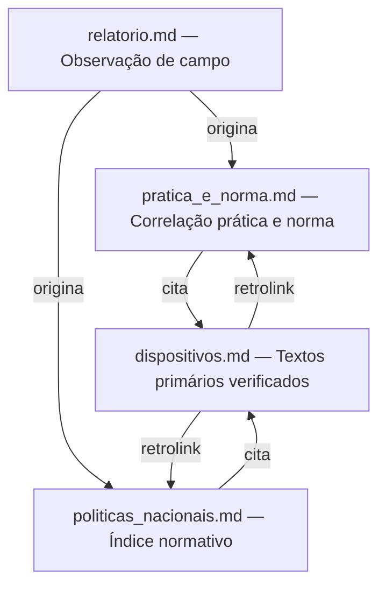

# Mapeamento Normativo da UBS Lázaro Moreno

**Uberaba-MG · Girassóis IV · Verificação: junho de 2026**

Este projeto mapeia, de forma determinística, os dispositivos das políticas nacionais de saúde que amparam cada ação observada na Unidade Básica de Saúde Lázaro Moreno. O ponto de partida é um relatório de visita de campo. O ponto de chegada é o texto primário, verificado na fonte oficial, de cada norma aplicável.

---

## Por que este projeto existe

Políticas nacionais de saúde existem em papel. A questão determinante é: **qual dispositivo específico, de qual portaria vigente, fundamenta o que uma equipe de saúde faz todos os dias?**

Este repositório responde a essa pergunta para a UBS Lázaro Moreno. Mas a estrutura é replicável para qualquer UBS.

---

## Arquitetura dos documentos

| Arquivo | Papel | Lê antes de... |
|---|---|---|
| [`relatorio.md`](relatorio.md) | Observação de campo — o que a UBS faz | Qualquer outro |
| [`pratica_e_norma.md`](pratica_e_norma.md) | Correlação entre cada ação observada e o dispositivo que a ampara | [`dispositivos.md`](dispositivos.md) |
| [`politicas_nacionais.md`](politicas_nacionais.md) | Índice organizado por política: dispositivos, transcrições resumidas e relação com o relatório | [`dispositivos.md`](dispositivos.md) |
| [`dispositivos.md`](dispositivos.md) | Textos primários completos, links às fontes oficiais e retrolinks aos documentos analíticos | — |

---

## Princípio DRY aplicado à norma

O texto de cada dispositivo legal vive em **um único lugar**: [`dispositivos.md`](dispositivos.md).

Os documentos analíticos (`pratica_e_norma.md` e `politicas_nacionais.md`) apenas **referenciam** esses textos via links. Se uma portaria for revogada ou atualizada:

1. Edite **apenas** [`dispositivos.md`](dispositivos.md)
2. Atualize o status do instrumento (`[vigente]` → `[revogado]` ou `[atualizado]`)
3. Registre o instrumento substituto com o novo anchor
4. Os links dos demais documentos **não precisam ser alterados** — a ancoragem por ID é estável

---

## Metodologia

**Ponto de partida**: relatório de visita de campo à UBS Lázaro Moreno ([`relatorio.md`](relatorio.md)).

**Cadeia de verificação**:
1. Cada ação ou situação descrita no relatório foi identificada como um aspecto a ser fundamentado normativamente.
2. A política nacional aplicável foi identificada.
3. O dispositivo específico (artigo, inciso, alínea, item do Anexo) foi localizado **diretamente no texto oficial** publicado no portal BVSMS/Ministério da Saúde (bvsms.saude.gov.br) ou no portal gov.br/saude — incluindo as Matrizes de Consolidação para portarias revogadas por consolidação em 2017.
4. A vigência de cada instrumento foi verificada ativamente, com busca por revogações, substituições e atualizações relevantes.

**O que "determinístico" significa aqui**: cada dispositivo citado pode ser localizado na fonte que consta em [`dispositivos.md`](dispositivos.md), na URL indicada, e o texto transcrito pode ser verificado por qualquer pessoa. Não há inferência sobre o conteúdo da norma — apenas transcrição do verificado.

**Escopo**: somente instrumentos com correspondência direta a ações descritas no relatório de campo. Políticas gerais sem ação correlata observada não foram incluídas.

---

## Convenções de status dos instrumentos

| Símbolo | Significado |
|---|---|
| `[vigente]` | Portaria/lei em vigor na íntegra |
| `[via consolidação]` | Portaria revogada por consolidação em 2017; conteúdo intacto e vinculante via Portaria de Consolidação GM/MS indicada |
| `[atualizado]` | Instrumento vigente com modificações posteriores indicadas no texto |
| `[vigente — ver nota]` | Vigente, com ressalva sobre escopo ou aspecto específico |

---

## Instrumentos mapeados

| Instrumento | Status | Documento |
|---|---|---|
| PNAB — Portaria GM/MS nº 2.436/2017 | [vigente] | [dispositivos.md §1](dispositivos.md#1-pnab--portaria-gm/ms-nº-24362017) |
| Financiamento APS — Portaria GM/MS nº 3.493/2024 | [vigente] [atualizado] | [dispositivos.md §2](dispositivos.md#2-financiamento-aps--portaria-gm/ms-nº-34932024) |
| eMulti — Portaria GM/MS nº 635/2023 | [vigente] | [dispositivos.md §3](dispositivos.md#3-emulti--portaria-gm/ms-nº-6352023) |
| PNSB — Portaria GM/MS nºs 1.444/2000 e 267/2001 + Documento 2004 | [vigente — ver nota] | [dispositivos.md §4](dispositivos.md#4-pnsb--política-nacional-de-saúde-bucal--brasil-sorridente) |
| PNPS — Portaria GM/MS nº 2.446/2014 | [via consolidação — PRC 2/2017, Anexo I] | [dispositivos.md §5](dispositivos.md#5-pnps--portaria-gm/ms-nº-24462014) |
| PNEPS — Portaria GM/MS nº 2.761/2013 | [via consolidação — PRC 2/2017, Anexo V] | [dispositivos.md §6](dispositivos.md#6-pneps--portaria-gm/ms-nº-27612013) |
| PNH/HumanizaSUS — MS, 2003 | [vigente — documento programático] | [dispositivos.md §7](dispositivos.md#7-pnhhmanizasus--ministério-da-saúde-2003) |
| PNSPI — Portaria GM/MS nº 2.528/2006 | [vigente] | [dispositivos.md §8](dispositivos.md#8-pnspi--portaria-gm/ms-nº-25282006) |
| PNAISC — Portaria GM/MS nº 1.130/2015 | [via consolidação — PRC 2/2017, Anexo X] | [dispositivos.md §9](dispositivos.md#9-pnaisc--portaria-gm/ms-nº-11302015) |
| PNTN — Portaria GM/MS nº 822/2001 | [via consolidação — PRC 5/2017] [atualizado — Portaria 7.293/2025] | [dispositivos.md §10](dispositivos.md#10-pntn--portaria-gm/ms-nº-8222001) |
| Rede Cegonha — Portaria GM/MS nº 1.459/2011 | [via consolidação — PRC 3/2017, Anexo II] | [dispositivos.md §11](dispositivos.md#11-rede-cegonha--portaria-gm/ms-nº-14592011) |
| RAPS — Portaria GM/MS nº 3.088/2011 | [via consolidação — PRC 3/2017, Anexo V] | [dispositivos.md §12](dispositivos.md#12-raps--portaria-gm/ms-nº-30882011) |
| DCNT — Portaria GM/MS nº 483/2014 | [via consolidação — PRC 3/2017] | [dispositivos.md §13](dispositivos.md#13-dcnt--portaria-gm/ms-nº-4832014) |
| Hanseníase — Portaria GM/MS nº 149/2016 | [via consolidação — PRC 2/2017, Anexo VI] | [dispositivos.md §14](dispositivos.md#14-hanseníase--portaria-gm/ms-nº-1492016) |
| Tuberculose — Portaria GM/MS nº 154/2022 + 264/2020 | [vigente] | [dispositivos.md §15](dispositivos.md#15-tuberculose) |
| PNAN — Portaria GM/MS nº 2.715/2011 | [via consolidação — PRC 2/2017, Anexo III] | [dispositivos.md §16](dispositivos.md#16-pnan--portaria-gm/ms-nº-27152011) |
| PNI — Lei nº 6.259/1975 + Decreto nº 78.231/1976 | [vigente] | [dispositivos.md §17](dispositivos.md#17-pni--lei-nº-62591975--decreto-nº-782311976) |

---

## Como replicar para outra UBS

1. Faça fork ou copie este repositório
2. Substitua o conteúdo de `relatorio.md` pelo relatório da nova unidade
3. Em `pratica_e_norma.md`, correlacione as ações da nova UBS aos dispositivos
4. Em `politicas_nacionais.md`, mantenha ou adicione políticas aplicáveis
5. Em `dispositivos.md`, adicione ou remova dispositivos conforme as ações observadas
6. Atualize o `README.md` com os dados da nova unidade

Os dispositivos já mapeados em `dispositivos.md` são reutilizáveis entre unidades — a maioria das normas é nacional e se aplica a qualquer UBS do SUS.

---

## Como atualizar quando uma portaria mudar

1. Abra `dispositivos.md`
2. Localize a seção do instrumento alterado
3. Atualize o status e o texto do dispositivo
4. Se o instrumento foi revogado e substituído, adicione a nova seção com novo anchor e marque o antigo como `[revogado em DD/MM/AAAA — substituído por ...]`
5. Verifique se os links em `pratica_e_norma.md` e `politicas_nacionais.md` ainda apontam para o anchor correto

---

## Unidade documentada

**Nome**: Unidade Básica de Saúde Lázaro Moreno
**Endereço**: Rua Otaviano Francisco da Silva, nº 51 — Bairro Girassóis IV
**Município**: Uberaba, Minas Gerais
**CEP**: 38048-304
**Funcionamento**: segunda a sexta-feira, 7h às 17h
**População atendida**: ~12.000 habitantes (conjuntos habitacionais Girassóis IV)

---

*Verificação: junho de 2026 · Fonte principal: [bvsms.saude.gov.br](https://bvsms.saude.gov.br) e [gov.br/saude](https://www.gov.br/saude)*
